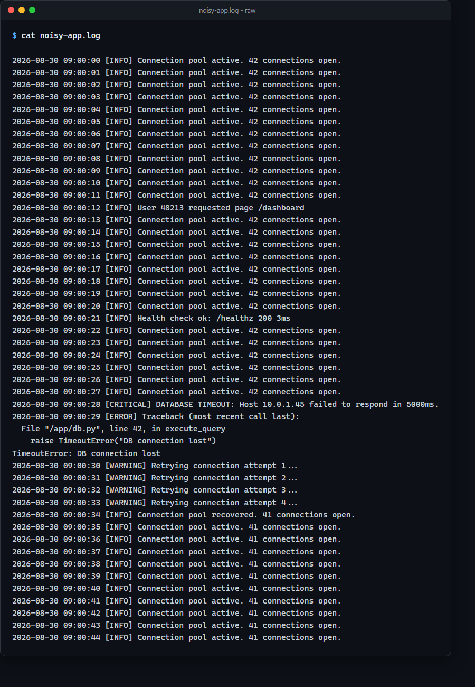
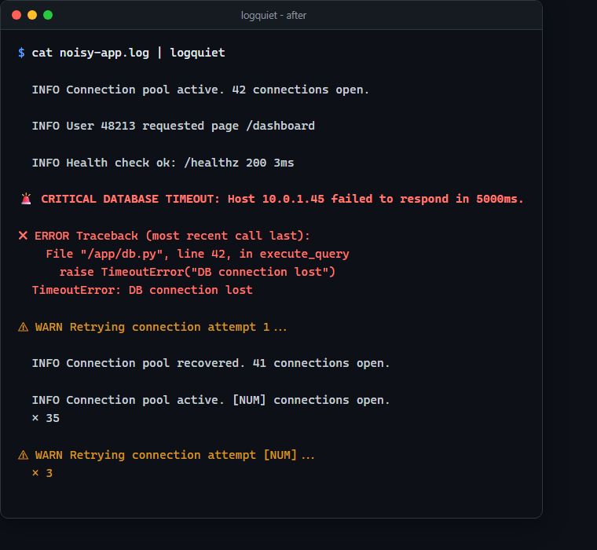
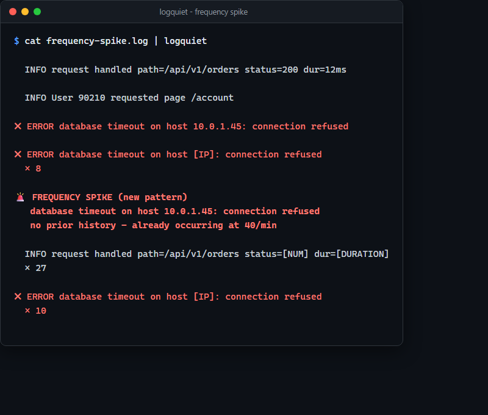
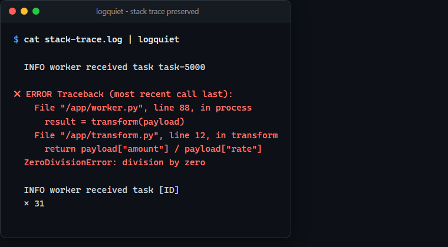

# LogQuiet

**LogQuiet makes noisy live logs readable by collapsing routine repetition while prioritizing and surfacing new, error-level, and anomalously frequent events.**

```bash
kubectl logs -f deployment/api | logquiet
```

## See it in action

A synthetic, high-volume application log with routine health-check/DB-status
noise and one buried critical failure - both screenshots are real captured
`logquiet` output against a checked-in fixture, not mockups (see
[demo/README.md](demo/README.md) to reproduce them yourself):

**Before** - the raw stream:



**After** - piped through `logquiet`:



```
raw logs -> structural normalization -> routine noise collapsed -> important events remain visible
```

It is a local, zero-configuration Unix-style filter - pipe a log stream
into it, get a readable stream back. No account, no cloud service, no
LLM, no network calls, no telemetry.

## Before / after, in text

The same idea, as plain text so it's copy-pasteable (synthetic example):

Raw input:

```
2026-08-30 03:01:00 [INFO] Connection pool active. 42 connections open.
2026-08-30 03:01:01 [INFO] Connection pool active. 42 connections open.
2026-08-30 03:01:02 [INFO] Connection pool active. 42 connections open.
2026-08-30 03:01:03 [INFO] Connection pool active. 42 connections open.
2026-08-30 03:01:04 [INFO] Connection pool active. 42 connections open.
2026-08-30 03:01:05 [INFO] User 10829 requested page /dashboard
2026-08-30 03:01:06 [INFO] Connection pool active. 42 connections open.
2026-08-30 03:01:07 [CRITICAL] DATABASE TIMEOUT: Host 10.0.1.45 failed to respond in 5000ms.
2026-08-30 03:01:07 [ERROR] Traceback (most recent call last):
2026-08-30 03:01:07 [ERROR]   File "/app/db.py", line 42, in execute_query
2026-08-30 03:01:07 [ERROR]     raise TimeoutError("DB connection lost")
2026-08-30 03:01:07 [ERROR] TimeoutError: DB connection lost
2026-08-30 03:01:08 [WARNING] Retrying connection attempt 1...
2026-08-30 03:01:09 [WARNING] Retrying connection attempt 2...
2026-08-30 03:01:10 [WARNING] Retrying connection attempt 3...
```

Actual `logquiet --plain` output (captured verbatim, not mocked up):

```
  INFO Connection pool active. 42 connections open.

  INFO User 10829 requested page /dashboard

🚨 CRITICAL DATABASE TIMEOUT: Host 10.0.1.45 failed to respond in 5000ms.

✖ ERROR Traceback (most recent call last):
    File "/app/db.py", line 42, in execute_query
      raise TimeoutError("DB connection lost")
  TimeoutError: DB connection lost

⚠ WARN Retrying connection attempt 1...

  INFO Connection pool active. [NUM] connections open.
  × 5

⚠ WARN Retrying connection attempt [NUM]...
  × 2
```

Fifteen raw lines become nine, with nothing important lost: the critical
timeout and its full traceback survive untouched, the routine repeats
collapse into counters, and a message that only happened once
(`User 10829 requested page /dashboard`) is shown once, plainly, with its
real value. See "How rendering actually works" below for exactly why the
header lines look the way they do.

## Why LogQuiet?

- Collapse repetitive live-log noise automatically
- Keep errors and stack traces visible
- Surface sudden frequency spikes
- Run locally with no AI, cloud service, or telemetry

## Why this exists

Operational log streams often contain thousands or millions of repetitive
lines, which makes genuine failures hard to notice during debugging or an
incident. Exact-line tools (`uniq -c`) fail immediately because real logs
embed changing timestamps, request IDs, and other variables into otherwise
identical messages. LogQuiet recognizes the *structure* underneath those
variables, and - critically - does not assume "this recurs often" is
automatically safe to hide: a rare error suddenly spiking in frequency is
flagged as an anomaly, not quietly counted alongside routine noise. See
[docs/PRIOR_ART.md](docs/PRIOR_ART.md) for how this compares to existing
tools and what specifically is (and isn't) new here, and
[docs/TECHNICAL_METHOD.md](docs/TECHNICAL_METHOD.md) for the full
algorithm.

## Installation

### Download a release binary

Grab the binary for your platform from the
[Releases page](https://github.com/InfraGuard-Labs/logquiet/releases) (Linux
amd64/arm64, macOS Intel/Apple Silicon, Windows amd64) alongside
`SHA256SUMS.txt`, verify it (from the same directory you downloaded both
into: `sha256sum -c SHA256SUMS.txt --ignore-missing`, or run
`scripts/verify-release.sh` from this repo if you'd rather not worry about
which directory you're in - see
[docs/RELEASE_PROCESS.md](docs/RELEASE_PROCESS.md)), and put it on your
`PATH`.

### Build from source

Requires only the Go toolchain (no other dependencies - see
[SECURITY.md](SECURITY.md)):

```bash
git clone https://github.com/InfraGuard-Labs/logquiet.git
cd logquiet
go build -o logquiet ./cmd/logquiet
```

### Homebrew / Scoop

Formula and manifest templates are prepared in `packaging/` but not yet
published to a tap/bucket; see [docs/RELEASE_PROCESS.md](docs/RELEASE_PROCESS.md).

## Quick start

```bash
# Kubernetes
kubectl logs -f deployment/payment-api | logquiet

# Docker
docker logs -f my-container | logquiet
docker compose logs -f | logquiet

# systemd / journalctl
journalctl -u myservice -f | logquiet

# A plain file, live-tailed or not
tail -F application.log | logquiet
logquiet application.log
```

No flags are required for any of the above. Piping through `less`,
redirecting to a file, or running in CI all work correctly - LogQuiet
detects whether it's attached to a real terminal and adjusts automatically
(see "Modes" below).

## How structural matching works

Every message is normalized by replacing recognized variable classes with
placeholders before it's used to decide "have I seen this before":

```
10:00:01 User 10481 connected from 10.0.1.2
10:00:02 User 49210 connected from 10.0.1.8
```

both normalize to the same underlying template (timestamps are stripped
from the displayed prefix; the body normalizes to `User [NUM] connected
from [IP]`), so they're recognized as the same recurring pattern even
though no two characters after the level tag are identical.

Recognized classes: ISO-8601/syslog timestamps, dates, clock times, UUIDs,
MAC addresses, IPv4 (with optional port) and IPv6 addresses, memory
addresses, durations (`5000ms`, `1.5s`), byte sizes (`42.5MB`),
percentages, long hex hashes, generic alphanumeric identifiers
(`req-8f3ac2`), and bare numbers. The full table, the exact ordering
rules, and the precision-over-recall design principle (a class is only
substituted when the shape makes a false match unlikely) are in
[docs/TECHNICAL_METHOD.md](docs/TECHNICAL_METHOD.md).

**LogQuiet does not guess semantic meaning.** `User 10481` does not
become `User [ID]` - a bare number is always `[NUM]`, regardless of the
word next to it. Keyword-based semantic inference doesn't generalize
across languages and formats, and a wrong guess is worse than an honest
"this is some number." See TECHNICAL_METHOD.md for the reasoning.

## How rendering actually works (and why it isn't the naive design)

The **first time ever** a structural pattern is seen, LogQuiet shows it in
full, with its real values - not a template - because a first sighting is
exactly when real values are most useful. Every occurrence after that is
accumulated into a per-pattern counter and flushed as a compact
`template` / `× N` summary on a short, bounded cadence (2 seconds by
default; 500ms for ERROR-and-above severities) - independent of whether
other, different messages are interleaved in between. That last part
matters: a restart loop cycling through eight distinct log lines, or
several services' output merged by `docker compose logs`, both still
suppress correctly, because suppression is tracked per pattern, not as a
single "what's currently repeating" pointer. (An earlier version of this
tool only collapsed strictly back-to-back repeats and suppressed 0% of a
Kubernetes restart-loop fixture as a result - see
[docs/BENCHMARKS.md](docs/BENCHMARKS.md) for that story and the fix.)

LogQuiet deliberately does **not** try to redraw a single terminal line in
place with cursor-repositioning tricks (the "progress bar" style you might
expect). See [docs/TECHNICAL_METHOD.md](docs/TECHNICAL_METHOD.md) section
5 for why periodic summarization was chosen instead - in short, it is
correct for many simultaneously-recurring patterns and robust across
terminal multiplexers, at the cost of a small bounded delay before a count
visibly updates.

## Anomaly behavior: repetition is not automatically noise

An error occurring at 280 events/minute against a historical baseline of
0.1/minute is not "just more repetition" - it may be the incident itself.
LogQuiet tracks each pattern's own rolling rate against a slowly-adapting
baseline and raises a frequency-spike banner rather than silently folding
the spike into a routine counter (see Limitations below for the wall-clock
detection window this depends on):

```
🚨 FREQUENCY SPIKE
   database timeout on host 10.0.1.45
   baseline: 0.1/min
   current:  280/min
```

Real captured output for a brand-new error class bursting with zero prior
history - the "bootstrap" case, labeled honestly as such rather than
presenting an assumed baseline as a measured one (reproduce with
`demo/run-frequency-spike.sh`):



This uses a deterministic rolling-window-rate-vs-EWMA-baseline method -
not machine learning, not an LLM, fully local - with severity-aware
sensitivity (rare error classes are flagged at a lower multiplier than
routine chatter) and a cooldown so a sustained spike doesn't re-alert on
every single occurrence. Full method and defaults in
[docs/TECHNICAL_METHOD.md](docs/TECHNICAL_METHOD.md) section 7; every
threshold is a flag (see Configuration below).

## Multiline behavior

Python tracebacks, Java/JVM stack traces, and Go panics are recognized and
kept as one grouped event rather than being torn into unrelated one-line
events - including the common case where a container runtime (Docker,
Kubernetes) has prefixed every line, even the traceback's own indented
lines, with an identical timestamp. This is a line-shape heuristic, not a
per-language grammar; see
[docs/ARCHITECTURE.md](docs/ARCHITECTURE.md) "Known limitations" for what
it does and doesn't cover.

Real captured output for a buried Python traceback (reproduce with
`demo/run-stack-trace.sh`):



## Modes

| Flag | Behavior |
|---|---|
| *(none)* | Color, if stdout is a terminal; otherwise same as `--plain` |
| `--plain` | No color, no cursor control - for pipes, CI, and saved files |
| `--no-color` | Like the default, minus ANSI color codes |
| `--color` | Force ANSI color even when not attached to a terminal (piping through `less -R`, capturing colored output) - `--no-color` wins if both are given |
| `--json` | Newline-delimited JSON, one object per decision. Three stable `type` values: `event` (a novel pattern shown in full), `repeat_summary` (a periodic or final flush of a pattern's repeat count - the same type either way), and `anomaly` (a frequency-spike banner). |

## Statistics and impact reports

```bash
logquiet --stats app.log            # summary printed to stderr at the end
logquiet --impact-report out.json   # aggregate, content-free JSON (see below)
```

`--impact-report` writes **only** aggregate counts and rates - never raw
log content, hostnames, IPs, or any value observed in the input. Full
schema: [docs/IMPACT_REPORT.md](docs/IMPACT_REPORT.md). Privacy stance and
what LogQuiet never does: [docs/PRIVACY.md](docs/PRIVACY.md).

## Configuration

Zero-config is the default and is designed to be good enough for everyday
use. Every flag below is optional tuning - see `logquiet --help` for the
authoritative, always-current list:

| Flag | Default | Meaning |
|---|---|---|
| `--window` | `60` | Rolling window (seconds) for anomaly rate calculation |
| `--spike-multiplier` | `8` | Rate-vs-baseline ratio that triggers a spike for ordinary severities |
| `--protect-spike-multiplier` | `3` | Same, for severities at/above `--severity-protect` |
| `--severity-protect` | `ERROR` | Minimum severity treated as protected (`WARN`, `ERROR`, `CRITICAL`, `FATAL`) |
| `--min-window-events` | `5` | Minimum events in-window before a spike can fire (avoids alerting on tiny baselines) |
| `--cooldown` | `60` | Seconds between repeated spike alerts for the same pattern |
| `--max-patterns` | `10000` | Maximum distinct structural patterns tracked (memory bound) |

No configuration file is ever required or read.

## Performance

Real, reproducible measurements (not estimates) at 100K, 1M, and 10M
lines, including a deliberately adversarial all-unique-lines corpus that
exercises the bounded-memory eviction path, live in
[docs/BENCHMARKS.md](docs/BENCHMARKS.md). Headline: memory stays in the
low single-digit megabytes from 100K to 10M lines because pattern
tracking is bounded (default 10,000 patterns, LRU-evicted), and throughput
comfortably exceeds realistic live-tailing rates.

## Privacy

Fully local. No network calls, ever. No telemetry, by default or
otherwise - there is no opt-out because there is nothing to opt out of.
No persistence unless you explicitly pass `--impact-report`, which never
contains raw content. Full detail: [docs/PRIVACY.md](docs/PRIVACY.md).
Security model and dependency posture (zero third-party dependencies):
[SECURITY.md](SECURITY.md).

## Limitations

Stated plainly, not buried:

- Multiline grouping is a heuristic covering Python/Java/Node/Go shapes
  plus generic indentation - not a full grammar for every stack-trace
  dialect (Rust, .NET, Ruby are not specifically recognized).
- A coincidentally identifier-shaped common word at or above six
  characters mixing letters and digits (e.g. "sha256") will normalize to
  `[ID]` - a known, accepted precision/recall trade-off.
- Frequency-spike detection is wall-clock based, which is correct for its
  primary use case (live tailing). A brand-new severe error bursting
  immediately (no prior history at all) is caught within seconds even in
  a fast batch replay of a static file, via a dedicated bootstrap path -
  see [docs/TECHNICAL_METHOD.md](docs/TECHNICAL_METHOD.md) section 7.
  Detecting a spike in a pattern that already had an *established* low
  rate still needs about 15 seconds of real elapsed time to learn that
  rate, so a file that finishes replaying faster than that won't get
  standard-path detection for such a pattern within that single run.
- A pattern evicted from the bounded store and later seen again is
  treated as novel again - its history is gone, by design (see the
  bounded-memory guarantee above).

Full accounting: [docs/ARCHITECTURE.md](docs/ARCHITECTURE.md) and
[docs/TECHNICAL_METHOD.md](docs/TECHNICAL_METHOD.md) section 9.

## Benchmarks and correctness

LogQuiet is benchmarked on two axes that matter for a tool whose entire
job is hiding most of what you feed it: raw throughput, and - the more
important one - whether known-important events actually survive to the
output. Both are real, reproducible numbers in
[docs/BENCHMARKS.md](docs/BENCHMARKS.md), including a documented
regression this project's own benchmark suite caught during development.

## Contributing

Bug reports, fixture contributions (new realistic synthetic log shapes),
and small fixes are welcome - see [CONTRIBUTING.md](CONTRIBUTING.md) for
the development setup and testing expectations. Please read
[CODE_OF_CONDUCT.md](CODE_OF_CONDUCT.md) as well. Security issues should
be reported per [SECURITY.md](SECURITY.md), not as a public issue.

## License

[Apache License 2.0](LICENSE) - see [CONTRIBUTING.md](CONTRIBUTING.md)
for why this license was chosen.
